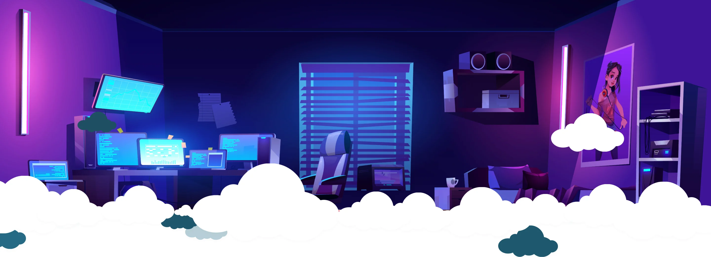

# Hi there 👋    Welcome to my GitHub Profile

## I'm a junior Computer Science and Engineering Student 

- from National Institute of Technology Patna, India 

- 🔭 I’m currently working on creating a website related to habits tracking
- 🌱 I’m currently learning DSA, coding, stuffs..
- 👯 I’m looking to collaborate on anything that interests me
- 🤔 I’m looking for help with different interesting project ideas
- 📫 How to reach me: ...
- 😄 Pronouns: she/her

---

### Spotify Playing 🎧

---
### Trying Out Languages and Tools 🛠

---

---

### Contact Me 
 

[][email]
[][linkedin]
[][instagram]

[email]: mailto:contact.smritigupta@gmail.com
[linkedin]:https://www.linkedin.com/in/contactsmriti/
[instagram]: https://www.instagram.com/heresmritigupta/

<!--
**contactsmriti/contactsmriti** is a ✨ _special_ ✨ repository because its `README.md` (this file) appears on your GitHub profile.

Here are some ideas to get you started:

- 🔭 I’m currently working on creating a website related to habits tracking
- 🌱 I’m currently learning DSA, coding, stuffs..
- 👯 I’m looking to collaborate on anything that interests me
- 🤔 I’m looking for help with different interesting project ideas
- 💬 Ask me about ...
- 📫 How to reach me: ...
- 😄 Pronouns: she/her
- ⚡ Fun fact: I love to do some Dancing(when I am in mood), swimming, writing anything, and never go for playing Badminton without me
-->

 
<a href="https://www.flaticon.com/free-icons/letter-c" title="letter c icons">Letter c icons created by shohanur.rahman13 - Flaticon</a>

<a href="https://iconscout.com/icons/javascript" target="_blank">Javascript Icon</a> by <a href="https://iconscout.com/contributors/maninderkaur">maninderkaur</a> on <a href="https://iconscout.com">IconScout</a>
<a href="https://www.flaticon.com/free-icons/html-5" title="html 5 icons">Html 5 icons created by Freepik - Flaticon</a>
<a target="_blank" href="https://icons8.com/icon/3BTBsJs5myRy/css3">CSS3</a> icon by <a target="_blank" href="https://icons8.com">Icons8</a>

<a target="_blank" href="https://icons8.com/icon/118557/github">GitHub</a> icon by <a target="_blank" href="https://icons8.com">Icons8</a>