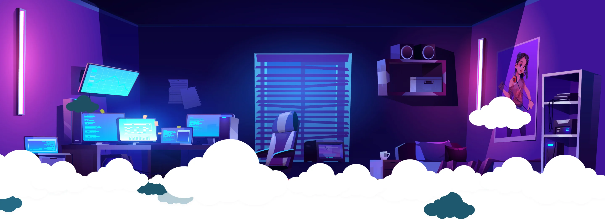

# Hi there 👋 I'm Smriti Gupta  

## 🚀 Software Engineer | Backend & Full Stack Developer  

- 💼 Currently working as a **Software Engineer at Nokia**
- 🎓 B.Tech in Computer Science from **NIT Patna**
- 💡 Former Intern at **Microsoft** & **Tata Elxsi**
- ⚙️ Passionate about **Backend Systems, APIs, and Scalable Architectures**
- 🌱 Currently exploring **System Design & Advanced Backend Concepts**
- 🛠️ Strong in **DSA, Problem Solving & Clean Code Practices**
- 🤝 Open to collaborating on impactful tech projects
- ✈️ Love traveling & collecting memories 🌍  

---

### 🎧 Currently Vibing To  

---

### 🛠️ Tech Stack  

---

### 📊 GitHub Stats  

---

### 📬 Let's Connect  

 

[][email]
[][linkedin]
[][instagram]
[][youtube]  

 

[email]: mailto:contact.smritigupta@gmail.com  
[linkedin]: https://www.linkedin.com/in/contactsmriti/  
[instagram]: https://www.instagram.com/heresmritigupta/  
[youtube]: https://www.youtube.com/@smritigupta3133  

---

✨ _“Building scalable systems and continuously evolving as an engineer.”_  
